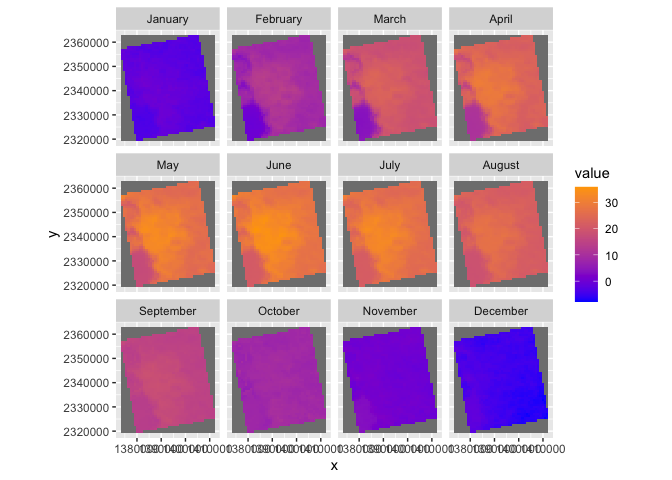

Case Study 10
================
Rachel Zhang

\#’

\#’ \#’ \# Tasks \#’

``` r
# install.packages("rasterVis")
# install.packages("kableExtra")
library(raster)
library(rasterVis)
library(rgdal)
library(ggmap)
library(tidyverse)
library(knitr)
library(kableExtra)
```

``` r
# New Packages
library(ncdf4) # to import data from netcdf format

## # Create a folder to hold the downloaded data
dir.create("data",showWarnings = F) #create a folder to hold the data

lulc_url="https://github.com/adammwilson/DataScienceData/blob/master/inst/extdata/appeears/MCD12Q1.051_aid0001.nc?raw=true"
lst_url="https://github.com/adammwilson/DataScienceData/blob/master/inst/extdata/appeears/MOD11A2.006_aid0001.nc?raw=true"

## # download them
download.file(lulc_url,destfile="data/MCD12Q1.051_aid0001.nc", mode="wb")
download.file(lst_url,destfile="data/MOD11A2.006_aid0001.nc", mode="wb")
```

\#’ \#’ \#’ You should also edit your .gitignore file (in your tasks
repository folder) to include `*data*` on one line. This will prevent
git from adding these files.  
\#’ \#’ \#’ \#\# Load data into R

``` r
lulc=stack("data/MCD12Q1.051_aid0001.nc",varname="Land_Cover_Type_1")
lst=stack("data/MOD11A2.006_aid0001.nc",varname="LST_Day_1km")
```

\#’ \#’ \#\# Explore LULC data

``` r
plot(lulc)
```

<!-- -->

``` r
#'  
#' 
#' We'll just pick one year to work with to keep this simple:
## ---- warning=F---------------------------------------------------------------
lulc=lulc[[13]]
plot(lulc)
```

<!-- -->

\#’ \#’ \#\#\# Process landcover data \#’ \#’ Assign land cover clases
from [MODIS
website](https://lpdaac.usgs.gov/dataset_discovery/modis/modis_products_table/mcd12q1)
\#’

``` r
Land_Cover_Type_1 = c(
  Water = 0, 
  `Evergreen Needleleaf forest` = 1, 
  `Evergreen Broadleaf forest` = 2,
  `Deciduous Needleleaf forest` = 3, 
  `Deciduous Broadleaf forest` = 4,
  `Mixed forest` = 5, 
  `Closed shrublands` = 6,
  `Open shrublands` = 7,
  `Woody savannas` = 8, 
  Savannas = 9,
  Grasslands = 10,
  `Permanent wetlands` = 11, 
  Croplands = 12,
  `Urban & built-up` = 13,
  `Cropland/Natural vegetation mosaic` = 14, 
  `Snow & ice` = 15,
  `Barren/Sparsely vegetated` = 16, 
  Unclassified = 254,
  NoDataFill = 255)

lcd=data.frame(
  ID=Land_Cover_Type_1,
  landcover=names(Land_Cover_Type_1),
  col=c("#000080","#008000","#00FF00", "#99CC00","#99FF99", "#339966", "#993366", "#FFCC99", "#CCFFCC", "#FFCC00", "#FF9900", "#006699", "#FFFF00", "#FF0000", "#999966", "#FFFFFF", "#808080", "#000000", "#000000"),
  stringsAsFactors = F)
# colors from https://lpdaac.usgs.gov/about/news_archive/modisterra_land_cover_types_yearly_l3_global_005deg_cmg_mod12c1
kable(head(lcd))
```

<table>
<thead>
<tr>
<th style="text-align:left;">
</th>
<th style="text-align:right;">
ID
</th>
<th style="text-align:left;">
landcover
</th>
<th style="text-align:left;">
col
</th>
</tr>
</thead>
<tbody>
<tr>
<td style="text-align:left;">
Water
</td>
<td style="text-align:right;">
0
</td>
<td style="text-align:left;">
Water
</td>
<td style="text-align:left;">
\#000080
</td>
</tr>
<tr>
<td style="text-align:left;">
Evergreen Needleleaf forest
</td>
<td style="text-align:right;">
1
</td>
<td style="text-align:left;">
Evergreen Needleleaf forest
</td>
<td style="text-align:left;">
\#008000
</td>
</tr>
<tr>
<td style="text-align:left;">
Evergreen Broadleaf forest
</td>
<td style="text-align:right;">
2
</td>
<td style="text-align:left;">
Evergreen Broadleaf forest
</td>
<td style="text-align:left;">
\#00FF00
</td>
</tr>
<tr>
<td style="text-align:left;">
Deciduous Needleleaf forest
</td>
<td style="text-align:right;">
3
</td>
<td style="text-align:left;">
Deciduous Needleleaf forest
</td>
<td style="text-align:left;">
\#99CC00
</td>
</tr>
<tr>
<td style="text-align:left;">
Deciduous Broadleaf forest
</td>
<td style="text-align:right;">
4
</td>
<td style="text-align:left;">
Deciduous Broadleaf forest
</td>
<td style="text-align:left;">
\#99FF99
</td>
</tr>
<tr>
<td style="text-align:left;">
Mixed forest
</td>
<td style="text-align:right;">
5
</td>
<td style="text-align:left;">
Mixed forest
</td>
<td style="text-align:left;">
\#339966
</td>
</tr>
</tbody>
</table>

\#’ \#’ Convert LULC raster into a ‘factor’ (categorical) raster. This
requires building the Raster Attribute Table (RAT). Unfortunately, this
is a bit of manual process as follows.

``` r
# convert to raster (easy)
lulc=as.factor(lulc)

# update the RAT with a left join
levels(lulc)=left_join(levels(lulc)[[1]],lcd)
```

    ## Joining, by = "ID"

``` r
# plot it
gplot(lulc)+
  geom_raster(aes(fill=as.factor(value)))+
  scale_fill_manual(values=levels(lulc)[[1]]$col,
                    labels=levels(lulc)[[1]]$landcover,
                    name="Landcover Type")+
  coord_equal()+
  theme(legend.position = "right")+
  guides(fill=guide_legend(ncol=1,byrow=TRUE))
```

<!-- -->

\#’ \# Land Surface Temperature

\#’ \#’ \#\# Convert LST to Degrees C \#’ You can convert LST from
Degrees Kelvin (K) to Celcius (C) with `offs()`. \#’

``` r
## -----------------------------------------------------------------------------
plot(lst[[1:12]])
```

<!-- -->

``` r
offs(lst)=-273.15
plot(lst[[1:10]])
```

<!-- -->

\#’ \#\# Add Dates to Z (time) dimension \#’ \#’ The default layer names
of the LST file include the date as follows: \#’

\#’ \#’ Convert those values to a proper R Date format by dropping the
“X” and using `as.Date()`. \#\# —————————————————————————–
tdates=names(lst)%&gt;% sub(pattern=“X”,replacement="“)%&gt;%
as.Date(”%Y.%m.%d")

names(lst)=1:nlayers(lst) lst=setZ(lst,tdates)

\#’ \#’ \#’ \#\# Part 1: Extract timeseries for a point \#’ \#’ Extract
LST values for a single point and plot them. \#’

``` r
names(lst)[1:5]
```

    ## [1] "X2000.02.18" "X2000.02.26" "X2000.03.05" "X2000.03.13" "X2000.03.21"

``` r
tdates=names(lst)%>%
  sub(pattern="X",replacement="")%>%
  as.Date("%Y.%m.%d")

names(lst)=1:nlayers(lst)
lst=setZ(lst,tdates)
```

``` r
#' 1. Use 
lw=SpatialPoints(data.frame(x= -78.791547,y=43.007211))
###to define a new Spatial Point at that location.

#' 2. Set the projection of your point with 
projection(lw)="+proj=longlat"

#' 3. Transform the point to the projection of the raster using 
lw=spTransform(lw,crs(lst))

#' 4. Extract the LST data for that location 
location=raster::extract(lst,lw,buffer=1000,fun=mean,na.rm=T)
location=t(location)
#You may want to transpose them with `t()` to convert it from a wide matrix to long vector.
```

``` r
#' 5. Extract the dates for each layer with 
dates=getZ(lst)
#combine them into a data.frame with the transposed raster values.  
data.frame(dates)
```

    ##          dates
    ## 1   2000-02-18
    ## 2   2000-02-26
    ## 3   2000-03-05
    ## 4   2000-03-13
    ## 5   2000-03-21
    ## 6   2000-03-29
    ## 7   2000-04-06
    ## 8   2000-04-14
    ## 9   2000-04-22
    ## 10  2000-04-30
    ## 11  2000-05-08
    ## 12  2000-05-16
    ## 13  2000-05-24
    ## 14  2000-06-01
    ## 15  2000-06-09
    ## 16  2000-06-17
    ## 17  2000-06-25
    ## 18  2000-07-03
    ## 19  2000-07-11
    ## 20  2000-07-19
    ## 21  2000-07-27
    ## 22  2000-08-04
    ## 23  2000-08-12
    ## 24  2000-08-20
    ## 25  2000-08-28
    ## 26  2000-09-05
    ## 27  2000-09-13
    ## 28  2000-09-21
    ## 29  2000-09-29
    ## 30  2000-10-07
    ## 31  2000-10-15
    ## 32  2000-10-23
    ## 33  2000-10-31
    ## 34  2000-11-08
    ## 35  2000-11-16
    ## 36  2000-11-24
    ## 37  2000-12-02
    ## 38  2000-12-10
    ## 39  2000-12-18
    ## 40  2000-12-26
    ## 41  2001-01-01
    ## 42  2001-01-09
    ## 43  2001-01-17
    ## 44  2001-01-25
    ## 45  2001-02-02
    ## 46  2001-02-10
    ## 47  2001-02-18
    ## 48  2001-02-26
    ## 49  2001-03-06
    ## 50  2001-03-14
    ## 51  2001-03-22
    ## 52  2001-03-30
    ## 53  2001-04-07
    ## 54  2001-04-15
    ## 55  2001-04-23
    ## 56  2001-05-01
    ## 57  2001-05-09
    ## 58  2001-05-17
    ## 59  2001-05-25
    ## 60  2001-06-02
    ## 61  2001-06-10
    ## 62  2001-07-04
    ## 63  2001-07-12
    ## 64  2001-07-20
    ## 65  2001-07-28
    ## 66  2001-08-05
    ## 67  2001-08-13
    ## 68  2001-08-21
    ## 69  2001-08-29
    ## 70  2001-09-06
    ## 71  2001-09-14
    ## 72  2001-09-22
    ## 73  2001-09-30
    ## 74  2001-10-08
    ## 75  2001-10-16
    ## 76  2001-10-24
    ## 77  2001-11-01
    ## 78  2001-11-09
    ## 79  2001-11-17
    ## 80  2001-11-25
    ## 81  2001-12-03
    ## 82  2001-12-11
    ## 83  2001-12-19
    ## 84  2001-12-27
    ## 85  2002-01-01
    ## 86  2002-01-09
    ## 87  2002-01-17
    ## 88  2002-01-25
    ## 89  2002-02-02
    ## 90  2002-02-10
    ## 91  2002-02-18
    ## 92  2002-02-26
    ## 93  2002-03-06
    ## 94  2002-03-14
    ## 95  2002-03-22
    ## 96  2002-03-30
    ## 97  2002-04-07
    ## 98  2002-04-15
    ## 99  2002-04-23
    ## 100 2002-05-01
    ## 101 2002-05-09
    ## 102 2002-05-17
    ## 103 2002-05-25
    ## 104 2002-06-02
    ## 105 2002-06-10
    ## 106 2002-06-18
    ## 107 2002-06-26
    ## 108 2002-07-04
    ## 109 2002-07-12
    ## 110 2002-07-20
    ## 111 2002-07-28
    ## 112 2002-08-05
    ## 113 2002-08-13
    ## 114 2002-08-21
    ## 115 2002-08-29
    ## 116 2002-09-06
    ## 117 2002-09-14
    ## 118 2002-09-22
    ## 119 2002-09-30
    ## 120 2002-10-08
    ## 121 2002-10-16
    ## 122 2002-10-24
    ## 123 2002-11-01
    ## 124 2002-11-09
    ## 125 2002-11-17
    ## 126 2002-11-25
    ## 127 2002-12-03
    ## 128 2002-12-11
    ## 129 2002-12-19
    ## 130 2002-12-27
    ## 131 2003-01-01
    ## 132 2003-01-09
    ## 133 2003-01-17
    ## 134 2003-01-25
    ## 135 2003-02-02
    ## 136 2003-02-10
    ## 137 2003-02-18
    ## 138 2003-02-26
    ## 139 2003-03-06
    ## 140 2003-03-14
    ## 141 2003-03-22
    ## 142 2003-03-30
    ## 143 2003-04-07
    ## 144 2003-04-15
    ## 145 2003-04-23
    ## 146 2003-05-01
    ## 147 2003-05-09
    ## 148 2003-05-17
    ## 149 2003-05-25
    ## 150 2003-06-02
    ## 151 2003-06-10
    ## 152 2003-06-18
    ## 153 2003-06-26
    ## 154 2003-07-04
    ## 155 2003-07-12
    ## 156 2003-07-20
    ## 157 2003-07-28
    ## 158 2003-08-05
    ## 159 2003-08-13
    ## 160 2003-08-21
    ## 161 2003-08-29
    ## 162 2003-09-06
    ## 163 2003-09-14
    ## 164 2003-09-22
    ## 165 2003-09-30
    ## 166 2003-10-08
    ## 167 2003-10-16
    ## 168 2003-10-24
    ## 169 2003-11-01
    ## 170 2003-11-09
    ## 171 2003-11-17
    ## 172 2003-11-25
    ## 173 2003-12-03
    ## 174 2003-12-11
    ## 175 2003-12-19
    ## 176 2003-12-27
    ## 177 2004-01-01
    ## 178 2004-01-09
    ## 179 2004-01-17
    ## 180 2004-01-25
    ## 181 2004-02-02
    ## 182 2004-02-10
    ## 183 2004-02-18
    ## 184 2004-02-26
    ## 185 2004-03-05
    ## 186 2004-03-13
    ## 187 2004-03-21
    ## 188 2004-03-29
    ## 189 2004-04-06
    ## 190 2004-04-14
    ## 191 2004-04-22
    ## 192 2004-04-30
    ## 193 2004-05-08
    ## 194 2004-05-16
    ## 195 2004-05-24
    ## 196 2004-06-01
    ## 197 2004-06-09
    ## 198 2004-06-17
    ## 199 2004-06-25
    ## 200 2004-07-03
    ## 201 2004-07-11
    ## 202 2004-07-19
    ## 203 2004-07-27
    ## 204 2004-08-04
    ## 205 2004-08-12
    ## 206 2004-08-20
    ## 207 2004-08-28
    ## 208 2004-09-05
    ## 209 2004-09-13
    ## 210 2004-09-21
    ## 211 2004-09-29
    ## 212 2004-10-07
    ## 213 2004-10-15
    ## 214 2004-10-23
    ## 215 2004-10-31
    ## 216 2004-11-08
    ## 217 2004-11-16
    ## 218 2004-11-24
    ## 219 2004-12-02
    ## 220 2004-12-10
    ## 221 2004-12-18
    ## 222 2004-12-26
    ## 223 2005-01-01
    ## 224 2005-01-09
    ## 225 2005-01-17
    ## 226 2005-01-25
    ## 227 2005-02-02
    ## 228 2005-02-10
    ## 229 2005-02-18
    ## 230 2005-02-26
    ## 231 2005-03-06
    ## 232 2005-03-14
    ## 233 2005-03-22
    ## 234 2005-03-30
    ## 235 2005-04-07
    ## 236 2005-04-15
    ## 237 2005-04-23
    ## 238 2005-05-01
    ## 239 2005-05-09
    ## 240 2005-05-17
    ## 241 2005-05-25
    ## 242 2005-06-02
    ## 243 2005-06-10
    ## 244 2005-06-18
    ## 245 2005-06-26
    ## 246 2005-07-04
    ## 247 2005-07-12
    ## 248 2005-07-20
    ## 249 2005-07-28
    ## 250 2005-08-05
    ## 251 2005-08-13
    ## 252 2005-08-21
    ## 253 2005-08-29
    ## 254 2005-09-06
    ## 255 2005-09-14
    ## 256 2005-09-22
    ## 257 2005-09-30
    ## 258 2005-10-08
    ## 259 2005-10-16
    ## 260 2005-10-24
    ## 261 2005-11-01
    ## 262 2005-11-09
    ## 263 2005-11-17
    ## 264 2005-11-25
    ## 265 2005-12-03
    ## 266 2005-12-11
    ## 267 2005-12-19
    ## 268 2005-12-27
    ## 269 2006-01-01
    ## 270 2006-01-09
    ## 271 2006-01-17
    ## 272 2006-01-25
    ## 273 2006-02-02
    ## 274 2006-02-10
    ## 275 2006-02-18
    ## 276 2006-02-26
    ## 277 2006-03-06
    ## 278 2006-03-14
    ## 279 2006-03-22
    ## 280 2006-03-30
    ## 281 2006-04-07
    ## 282 2006-04-15
    ## 283 2006-04-23
    ## 284 2006-05-01
    ## 285 2006-05-09
    ## 286 2006-05-17
    ## 287 2006-05-25
    ## 288 2006-06-02
    ## 289 2006-06-10
    ## 290 2006-06-18
    ## 291 2006-06-26
    ## 292 2006-07-04
    ## 293 2006-07-12
    ## 294 2006-07-20
    ## 295 2006-07-28
    ## 296 2006-08-05
    ## 297 2006-08-13
    ## 298 2006-08-21
    ## 299 2006-08-29
    ## 300 2006-09-06
    ## 301 2006-09-14
    ## 302 2006-09-22
    ## 303 2006-09-30
    ## 304 2006-10-08
    ## 305 2006-10-16
    ## 306 2006-10-24
    ## 307 2006-11-01
    ## 308 2006-11-09
    ## 309 2006-11-17
    ## 310 2006-11-25
    ## 311 2006-12-03
    ## 312 2006-12-11
    ## 313 2006-12-19
    ## 314 2006-12-27
    ## 315 2007-01-01
    ## 316 2007-01-09
    ## 317 2007-01-17
    ## 318 2007-01-25
    ## 319 2007-02-02
    ## 320 2007-02-10
    ## 321 2007-02-18
    ## 322 2007-02-26
    ## 323 2007-03-06
    ## 324 2007-03-14
    ## 325 2007-03-22
    ## 326 2007-03-30
    ## 327 2007-04-07
    ## 328 2007-04-15
    ## 329 2007-04-23
    ## 330 2007-05-01
    ## 331 2007-05-09
    ## 332 2007-05-17
    ## 333 2007-05-25
    ## 334 2007-06-02
    ## 335 2007-06-10
    ## 336 2007-06-18
    ## 337 2007-06-26
    ## 338 2007-07-04
    ## 339 2007-07-12
    ## 340 2007-07-20
    ## 341 2007-07-28
    ## 342 2007-08-05
    ## 343 2007-08-13
    ## 344 2007-08-21
    ## 345 2007-08-29
    ## 346 2007-09-06
    ## 347 2007-09-14
    ## 348 2007-09-22
    ## 349 2007-09-30
    ## 350 2007-10-08
    ## 351 2007-10-16
    ## 352 2007-10-24
    ## 353 2007-11-01
    ## 354 2007-11-09
    ## 355 2007-11-17
    ## 356 2007-11-25
    ## 357 2007-12-03
    ## 358 2007-12-11
    ## 359 2007-12-19
    ## 360 2007-12-27
    ## 361 2008-01-01
    ## 362 2008-01-09
    ## 363 2008-01-17
    ## 364 2008-01-25
    ## 365 2008-02-02
    ## 366 2008-02-10
    ## 367 2008-02-18
    ## 368 2008-02-26
    ## 369 2008-03-05
    ## 370 2008-03-13
    ## 371 2008-03-21
    ## 372 2008-03-29
    ## 373 2008-04-06
    ## 374 2008-04-14
    ## 375 2008-04-22
    ## 376 2008-04-30
    ## 377 2008-05-08
    ## 378 2008-05-16
    ## 379 2008-05-24
    ## 380 2008-06-01
    ## 381 2008-06-09
    ## 382 2008-06-17
    ## 383 2008-06-25
    ## 384 2008-07-03
    ## 385 2008-07-11
    ## 386 2008-07-19
    ## 387 2008-07-27
    ## 388 2008-08-04
    ## 389 2008-08-12
    ## 390 2008-08-20
    ## 391 2008-08-28
    ## 392 2008-09-05
    ## 393 2008-09-13
    ## 394 2008-09-21
    ## 395 2008-09-29
    ## 396 2008-10-07
    ## 397 2008-10-15
    ## 398 2008-10-23
    ## 399 2008-10-31
    ## 400 2008-11-08
    ## 401 2008-11-16
    ## 402 2008-11-24
    ## 403 2008-12-02
    ## 404 2008-12-10
    ## 405 2008-12-18
    ## 406 2008-12-26
    ## 407 2009-01-01
    ## 408 2009-01-09
    ## 409 2009-01-17
    ## 410 2009-01-25
    ## 411 2009-02-02
    ## 412 2009-02-10
    ## 413 2009-02-18
    ## 414 2009-02-26
    ## 415 2009-03-06
    ## 416 2009-03-14
    ## 417 2009-03-22
    ## 418 2009-03-30
    ## 419 2009-04-07
    ## 420 2009-04-15
    ## 421 2009-04-23
    ## 422 2009-05-01
    ## 423 2009-05-09
    ## 424 2009-05-17
    ## 425 2009-05-25
    ## 426 2009-06-02
    ## 427 2009-06-10
    ## 428 2009-06-18
    ## 429 2009-06-26
    ## 430 2009-07-04
    ## 431 2009-07-12
    ## 432 2009-07-20
    ## 433 2009-07-28
    ## 434 2009-08-05
    ## 435 2009-08-13
    ## 436 2009-08-21
    ## 437 2009-08-29
    ## 438 2009-09-06
    ## 439 2009-09-14
    ## 440 2009-09-22
    ## 441 2009-09-30
    ## 442 2009-10-08
    ## 443 2009-10-16
    ## 444 2009-10-24
    ## 445 2009-11-01
    ## 446 2009-11-09
    ## 447 2009-11-17
    ## 448 2009-11-25
    ## 449 2009-12-03
    ## 450 2009-12-11
    ## 451 2009-12-19
    ## 452 2009-12-27
    ## 453 2010-01-01
    ## 454 2010-01-09
    ## 455 2010-01-17
    ## 456 2010-01-25
    ## 457 2010-02-02
    ## 458 2010-02-10
    ## 459 2010-02-18
    ## 460 2010-02-26
    ## 461 2010-03-06
    ## 462 2010-03-14
    ## 463 2010-03-22
    ## 464 2010-03-30
    ## 465 2010-04-07
    ## 466 2010-04-15
    ## 467 2010-04-23
    ## 468 2010-05-01
    ## 469 2010-05-09
    ## 470 2010-05-17
    ## 471 2010-05-25
    ## 472 2010-06-02
    ## 473 2010-06-10
    ## 474 2010-06-18
    ## 475 2010-06-26
    ## 476 2010-07-04
    ## 477 2010-07-12
    ## 478 2010-07-20
    ## 479 2010-07-28
    ## 480 2010-08-05
    ## 481 2010-08-13
    ## 482 2010-08-21
    ## 483 2010-08-29
    ## 484 2010-09-06
    ## 485 2010-09-14
    ## 486 2010-09-22
    ## 487 2010-09-30
    ## 488 2010-10-08
    ## 489 2010-10-16
    ## 490 2010-10-24
    ## 491 2010-11-01
    ## 492 2010-11-09
    ## 493 2010-11-17
    ## 494 2010-11-25
    ## 495 2010-12-03
    ## 496 2010-12-11
    ## 497 2010-12-19
    ## 498 2010-12-27
    ## 499 2011-01-01
    ## 500 2011-01-09
    ## 501 2011-01-17
    ## 502 2011-01-25
    ## 503 2011-02-02
    ## 504 2011-02-10
    ## 505 2011-02-18
    ## 506 2011-02-26
    ## 507 2011-03-06
    ## 508 2011-03-14
    ## 509 2011-03-22
    ## 510 2011-03-30
    ## 511 2011-04-07
    ## 512 2011-04-15
    ## 513 2011-04-23
    ## 514 2011-05-01
    ## 515 2011-05-09
    ## 516 2011-05-17
    ## 517 2011-05-25
    ## 518 2011-06-02
    ## 519 2011-06-10
    ## 520 2011-06-18
    ## 521 2011-06-26
    ## 522 2011-07-04
    ## 523 2011-07-12
    ## 524 2011-07-20
    ## 525 2011-07-28
    ## 526 2011-08-05
    ## 527 2011-08-13
    ## 528 2011-08-21
    ## 529 2011-08-29
    ## 530 2011-09-06
    ## 531 2011-09-14
    ## 532 2011-09-22
    ## 533 2011-09-30
    ## 534 2011-10-08
    ## 535 2011-10-16
    ## 536 2011-10-24
    ## 537 2011-11-01
    ## 538 2011-11-09
    ## 539 2011-11-17
    ## 540 2011-11-25
    ## 541 2011-12-03
    ## 542 2011-12-11
    ## 543 2011-12-19
    ## 544 2011-12-27
    ## 545 2012-01-01
    ## 546 2012-01-09
    ## 547 2012-01-17
    ## 548 2012-01-25
    ## 549 2012-02-02
    ## 550 2012-02-10
    ## 551 2012-02-18
    ## 552 2012-02-26
    ## 553 2012-03-05
    ## 554 2012-03-13
    ## 555 2012-03-21
    ## 556 2012-03-29
    ## 557 2012-04-06
    ## 558 2012-04-14
    ## 559 2012-04-22
    ## 560 2012-04-30
    ## 561 2012-05-08
    ## 562 2012-05-16
    ## 563 2012-05-24
    ## 564 2012-06-01
    ## 565 2012-06-09
    ## 566 2012-06-17
    ## 567 2012-06-25
    ## 568 2012-07-03
    ## 569 2012-07-11
    ## 570 2012-07-19
    ## 571 2012-07-27
    ## 572 2012-08-04
    ## 573 2012-08-12
    ## 574 2012-08-20
    ## 575 2012-08-28
    ## 576 2012-09-05
    ## 577 2012-09-13
    ## 578 2012-09-21
    ## 579 2012-09-29
    ## 580 2012-10-07
    ## 581 2012-10-15
    ## 582 2012-10-23
    ## 583 2012-10-31
    ## 584 2012-11-08
    ## 585 2012-11-16
    ## 586 2012-11-24
    ## 587 2012-12-02
    ## 588 2012-12-10
    ## 589 2012-12-18
    ## 590 2012-12-26
    ## 591 2013-01-01
    ## 592 2013-01-09
    ## 593 2013-01-17
    ## 594 2013-01-25
    ## 595 2013-02-02
    ## 596 2013-02-10
    ## 597 2013-02-18
    ## 598 2013-02-26
    ## 599 2013-03-06
    ## 600 2013-03-14
    ## 601 2013-03-22
    ## 602 2013-03-30
    ## 603 2013-04-07
    ## 604 2013-04-15
    ## 605 2013-04-23
    ## 606 2013-05-01
    ## 607 2013-05-09
    ## 608 2013-05-17
    ## 609 2013-05-25
    ## 610 2013-06-02
    ## 611 2013-06-10
    ## 612 2013-06-18
    ## 613 2013-06-26
    ## 614 2013-07-04
    ## 615 2013-07-12
    ## 616 2013-07-20
    ## 617 2013-07-28
    ## 618 2013-08-05
    ## 619 2013-08-13
    ## 620 2013-08-21
    ## 621 2013-08-29
    ## 622 2013-09-06
    ## 623 2013-09-14
    ## 624 2013-09-22
    ## 625 2013-09-30
    ## 626 2013-10-08
    ## 627 2013-10-16
    ## 628 2013-10-24
    ## 629 2013-11-01
    ## 630 2013-11-09
    ## 631 2013-11-17
    ## 632 2013-11-25
    ## 633 2013-12-03
    ## 634 2013-12-11
    ## 635 2013-12-19
    ## 636 2013-12-27
    ## 637 2014-01-01
    ## 638 2014-01-09
    ## 639 2014-01-17
    ## 640 2014-01-25
    ## 641 2014-02-02
    ## 642 2014-02-10
    ## 643 2014-02-18
    ## 644 2014-02-26
    ## 645 2014-03-06
    ## 646 2014-03-14
    ## 647 2014-03-22
    ## 648 2014-03-30
    ## 649 2014-04-07
    ## 650 2014-04-15
    ## 651 2014-04-23
    ## 652 2014-05-01
    ## 653 2014-05-09
    ## 654 2014-05-17
    ## 655 2014-05-25
    ## 656 2014-06-02
    ## 657 2014-06-10
    ## 658 2014-06-18
    ## 659 2014-06-26
    ## 660 2014-07-04
    ## 661 2014-07-12
    ## 662 2014-07-20
    ## 663 2014-07-28
    ## 664 2014-08-05
    ## 665 2014-08-13
    ## 666 2014-08-21
    ## 667 2014-08-29
    ## 668 2014-09-06
    ## 669 2014-09-14
    ## 670 2014-09-22
    ## 671 2014-09-30
    ## 672 2014-10-08
    ## 673 2014-10-16
    ## 674 2014-10-24
    ## 675 2014-11-01
    ## 676 2014-11-09
    ## 677 2014-11-17
    ## 678 2014-11-25
    ## 679 2014-12-03
    ## 680 2014-12-11
    ## 681 2014-12-19
    ## 682 2014-12-27
    ## 683 2015-01-01
    ## 684 2015-01-09
    ## 685 2015-01-17
    ## 686 2015-01-25
    ## 687 2015-02-02
    ## 688 2015-02-10
    ## 689 2015-02-18
    ## 690 2015-02-26
    ## 691 2015-03-06
    ## 692 2015-03-14
    ## 693 2015-03-22
    ## 694 2015-03-30
    ## 695 2015-04-07
    ## 696 2015-04-15
    ## 697 2015-04-23
    ## 698 2015-05-01
    ## 699 2015-05-09
    ## 700 2015-05-17
    ## 701 2015-05-25
    ## 702 2015-06-02
    ## 703 2015-06-10
    ## 704 2015-06-18
    ## 705 2015-06-26
    ## 706 2015-07-04
    ## 707 2015-07-12
    ## 708 2015-07-20
    ## 709 2015-07-28
    ## 710 2015-08-05
    ## 711 2015-08-13
    ## 712 2015-08-21
    ## 713 2015-08-29
    ## 714 2015-09-06
    ## 715 2015-09-14
    ## 716 2015-09-22
    ## 717 2015-09-30
    ## 718 2015-10-08
    ## 719 2015-10-16
    ## 720 2015-10-24
    ## 721 2015-11-01
    ## 722 2015-11-09
    ## 723 2015-11-17
    ## 724 2015-11-25
    ## 725 2015-12-03
    ## 726 2015-12-11
    ## 727 2015-12-19
    ## 728 2015-12-27
    ## 729 2016-01-01
    ## 730 2016-01-09
    ## 731 2016-01-17
    ## 732 2016-01-25
    ## 733 2016-02-02
    ## 734 2016-02-10
    ## 735 2016-02-18
    ## 736 2016-02-26
    ## 737 2016-03-05
    ## 738 2016-03-13
    ## 739 2016-03-21
    ## 740 2016-03-29
    ## 741 2016-04-06
    ## 742 2016-04-14
    ## 743 2016-04-22
    ## 744 2016-04-30
    ## 745 2016-05-08
    ## 746 2016-05-16
    ## 747 2016-05-24
    ## 748 2016-06-01
    ## 749 2016-06-09
    ## 750 2016-06-17
    ## 751 2016-06-25
    ## 752 2016-07-03
    ## 753 2016-07-11
    ## 754 2016-07-19
    ## 755 2016-07-27
    ## 756 2016-08-04
    ## 757 2016-08-12
    ## 758 2016-08-20
    ## 759 2016-08-28
    ## 760 2016-09-05
    ## 761 2016-09-13
    ## 762 2016-09-21
    ## 763 2016-09-29
    ## 764 2016-10-07
    ## 765 2016-10-15
    ## 766 2016-10-23
    ## 767 2016-10-31
    ## 768 2016-11-08
    ## 769 2016-11-16
    ## 770 2016-11-24
    ## 771 2016-12-02
    ## 772 2016-12-10
    ## 773 2016-12-18
    ## 774 2016-12-26
    ## 775 2017-01-01
    ## 776 2017-01-09
    ## 777 2017-01-17
    ## 778 2017-01-25
    ## 779 2017-02-02
    ## 780 2017-02-10
    ## 781 2017-02-18
    ## 782 2017-02-26
    ## 783 2017-03-06
    ## 784 2017-03-14
    ## 785 2017-03-22
    ## 786 2017-03-30
    ## 787 2017-04-07
    ## 788 2017-04-15
    ## 789 2017-04-23
    ## 790 2017-05-01
    ## 791 2017-05-09
    ## 792 2017-05-17
    ## 793 2017-05-25
    ## 794 2017-06-02
    ## 795 2017-06-10
    ## 796 2017-06-18
    ## 797 2017-06-26
    ## 798 2017-07-04
    ## 799 2017-07-12
    ## 800 2017-07-20
    ## 801 2017-07-28
    ## 802 2017-08-05
    ## 803 2017-08-13
    ## 804 2017-08-21
    ## 805 2017-08-29
    ## 806 2017-09-06
    ## 807 2017-09-14
    ## 808 2017-09-22
    ## 809 2017-09-30
    ## 810 2017-10-08
    ## 811 2017-10-16

``` r
combined=cbind.data.frame(dates,location)
```

\#`or`bind\_cols()\` to do this. The goal is to make a single dataframe
with the dates and lst values in columns.

``` r
#' 6. Plot it with `ggplot()` including points for the raw data and a smooth version as a line.  You will probably want to adjust both `span` and `n` in `geom_smooth`.
ggplot(combined,aes(x=dates,y=location))+
  geom_point()+
  geom_smooth(span=0.05,n=100)
```

    ## `geom_smooth()` using method = 'loess' and formula 'y ~ x'

    ## Warning: Removed 82 rows containing non-finite values (stat_smooth).

    ## Warning: Removed 82 rows containing missing values (geom_point).

<!-- -->

\#’ \#’ See the `library(rts)` for more timeseries related functions.
\#’ \#’ \#’ \# Part 2: Summarize weekly data to monthly climatologies
\#’

``` r
#' 1. First make a variable called `` by converting the dates to months using
tmonth=as.numeric(format(getZ(lst),"%m"))
#' 2. Use `stackApply()` to summarize the mean value per month (using the `tmonth` variable you just created) and save the results as `lst_month`.
lst_month=stackApply(lst,tmonth,fun = mean)
#' 3. Set the names of the layers to months with `names(lst_month)=month.name`
names(lst_month)=month.name
#' 4. Plot the map for each month with `gplot()` in the RasterVis Package.
rasterVis::gplot(lst_month)+
  geom_tile(aes(fill=value))+
  facet_wrap(~ variable) +
  scale_fill_gradient(low = 'blue', high = 'orange') +
  coord_equal()
```

<!-- -->

``` r
#' 5. Calculate the monthly mean for the entire image with `cellStats(lst_month,mean)`
monthlymean=cellStats(lst_month,mean)
```
