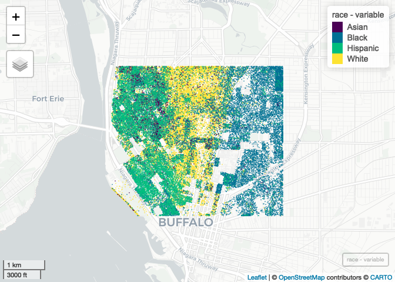

Case Study 11
================
Rachel Zhang
November 16, 2021

``` r
library(tidyverse)
library(spData)
library(sf)

## New Packages
# install.packages("mapview")
# install.packages("foreach")
# install.packages("doParallel")
library(mapview) # new package that makes easy leaflet maps
library(foreach)
library(doParallel)
registerDoParallel(4)
getDoParWorkers() # check registered cores
```

    ## [1] 4

``` r
library(tidycensus)
census_api_key ("7e9b9dfdae5d56fbf2a5c8e243c74bccbe74af98", install=TRUE,overwrite = TRUE)
```

    ## [1] "7e9b9dfdae5d56fbf2a5c8e243c74bccbe74af98"

``` r
racevars <- c(White = "P005003", 
              Black = "P005004", 
              Asian = "P005006", 
              Hispanic = "P004003")
options(tigris_use_cache = TRUE)
erie <- get_decennial(geography = "block", variables = racevars, 
                  state = "NY", county = "Erie County", geometry = TRUE,
                  summary_var = "P001001", cache_table=T) 

###crop the county-level data
erie_reduced=st_crop(erie,xmin=-78.9,xmax=-78.85,ymin=42.888,ymax=42.92)
```

``` r
###do one variable at a time
race=foreach(r=unique(erie_reduced$variable),.combine='rbind') %dopar% {
  filter(erie_reduced,variable==r) %>% #do one race at each time
    st_sample(size=.$value) %>%  #generate random points
    st_as_sf() %>% #convert to sf objects
    mutate(variable=r)
}
```

``` r
#draw the map
mapview(race,zcol="variable",cex=0.1,alpha=0)
```

<!-- -->
